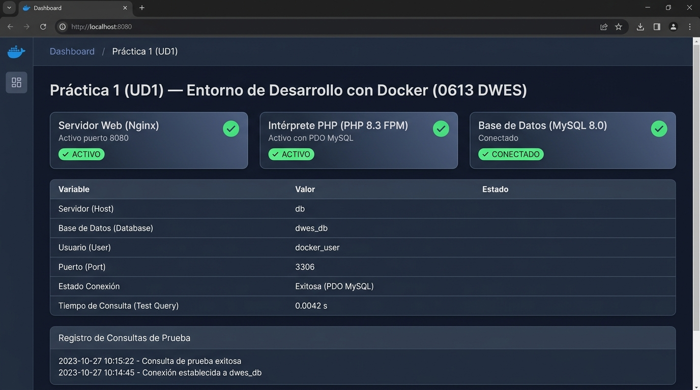

# Práctica 1 (UD1) — Arranque del entorno de desarrollo con Docker

**Módulo:** 0613 · Desarrollo Web en Entorno Servidor (DWES)  
**Curso:** 2º DAW A  
**Modalidad:** Trabajo individual  

---

## 📌 Descripción del Proyecto

Este proyecto sustituye la instalación clásica de entornos locales en un único paquete (como XAMPP) por una arquitectura modular basada en **contenedores Docker independientes e interconectados**, definida a través de `docker-compose.yml`.

### 🏗️ Arquitectura de Contenedores

El entorno se compone de tres servicios conectados en una red interna (`app-network`):

1. **`web` (Nginx):**
   - Imagen: `nginx:alpine`
   - Función: Recibe las peticiones HTTP externas en el puerto **8080** del anfitrión y actúa como proxy inverso y servidor FastCGI hacia PHP.
2. **`php` (PHP-FPM):**
   - Construido mediante `php/Dockerfile` a partir de `php:8.3-fpm-alpine`.
   - Función: Ejecuta el código PHP 8.3 e incluye las extensiones necesarias (`pdo`, `pdo_mysql`) para interactuar con la base de datos.
3. **`db` (MySQL):**
   - Imagen: `mysql:8.0`
   - Función: Almacena de forma persistente los datos mediante un volumen con nombre (`db_data`), permitiendo la conexión de PHP mediante PDO.

---

## 📁 Estructura del Repositorio

```text
Practica1-UD1/
├── docker-compose.yml     # Orquestación de los 3 contenedores
├── php/
│   └── Dockerfile         # Imagen personalizada de PHP 8.3 con pdo_mysql
├── nginx/
│   └── default.conf       # Configuración de Nginx y paso FastCGI a php:9000
├── src/
│   └── index.php          # Código de prueba y verificación de conexión PDO
├── README.md              # Documentación de la práctica
└── .gitignore             # Archivos excluidos del control de versiones
```

---

## 🚀 Requisitos Previos

- Tener instalado [Docker Desktop](https://www.docker.com/products/docker-desktop/) (o el motor de Docker con el plugin Docker Compose).
- Tener Git instalado para el control de versiones.

---

## 🛠️ Cómo Levantar el Entorno

1. **Clonar el repositorio:**
   ```bash
   git clone <URL_DE_TU_REPOSITORIO>
   cd Practica1-UD1
   ```

2. **Construir y arrancar los contenedores en segundo plano:**
   ```bash
   docker compose up -d --build
   ```

3. **Verificar el estado de los contenedores:**
   ```bash
   docker compose ps
   ```

4. **Acceder a la aplicación:**
   Abre tu navegador web y visita:
   [http://localhost:8080](http://localhost:8080)

5. **Detener el entorno:**
   - Para parar los contenedores manteniendo los datos:
     ```bash
     docker compose down
     ```
   - Para parar y eliminar volúmenes asociados:
     ```bash
     docker compose down -v
     ```

---

## 📸 Captura de Pantalla del Resultado

A continuación se muestra el resultado al acceder a `http://localhost:8080` con los tres servicios plenamente operativos:


